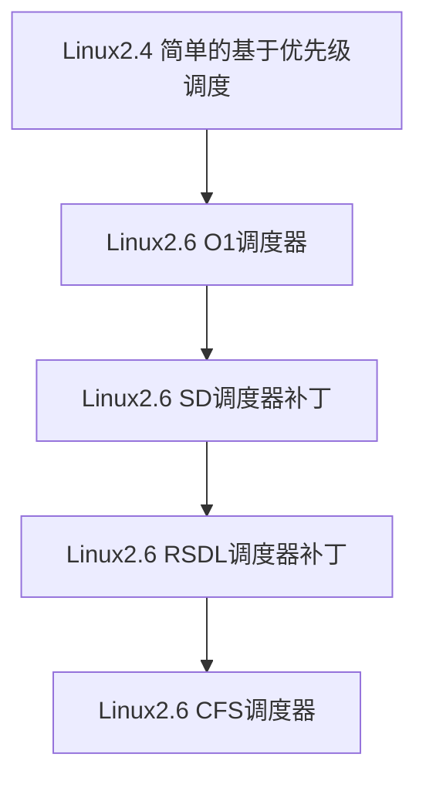

# 操作系统实习报告2——线程调度

2020.3

[TOC]

## 内容一 总体概述

本次Lab的主题是线程调度，我在学习Linux、Windows调度算法和阅读Nachos中有关线程调度机制的代码基础上，首先实现了基于优先级的抢占式调度算法，继而模仿Linux2.4的调度器实现了简单的时间片轮转调度算法和多级队列反馈调度算法。通过自己动手编写调度器，我对线程调度、时钟、中断等机制有了更深刻的认识。

## 内容二 完成情况

任务完成情况

- [x] Exercise 1
- [x] Exercise 2
- [x] Exercise 3
- [x] Challenge(完成时间片轮转和多级队列反馈两种调度算法)

具体完成情况：

### Exercise 1(调度算法调研)

> 调研Linux或Windows中采用的进程/线程调度算法

#### Linux进程调度算法简介

Linux的线程是内核线程，调度器的调度对象是进程。以下主要参考维基百科[Scheduling (computing)](https://en.wikipedia.org/wiki/Scheduling_(computing)#Linux)词条【1】和论文[A complete guide to Linux process scheduling](https://trepo.tuni.fi/bitstream/handle/10024/96864/GRADU-1428493916.pdf)【2】，对Linux系统不同版本使用的进程调度算法给出简介。

##### 早期版本

Linux 0.0.1 版本就已经有了一个简单的调度器，该调度器只维护了一个全局的进程队列，每次都需要遍历该队列来寻找新的进程执行，而且对任务数量还有严格限制（`NR_TASKS` 在最初的版本中只有 32）。

##### `Linux2.4`O(n)调度器

2.4 版本的 Linux 内核使用带有**多级优先队列反馈的O(n)调度器**，结合时间片轮转和多级优先队列反馈，每个进程在创建时被赋予时间片和优先级，时钟中断递减当前运行进程的时间片，当进程的时间片用完则进入相应优先级队列的队尾等待重新赋予时间片。优先级范围为0-140，进程分为实时进程(real-time task)和普通进程(nice task levels)：

> 0–99 are reserved for real-time tasks and 100–140 are considered [nice](https://en.wikipedia.org/wiki/Nice_(Unix)) task levels. For real-time tasks, the time quantum for switching processes was approximately 200 ms, and for nice tasks approximately 10 ms

实时进程的优先级是静态设定的，始终高于普通进程的优先级，如此便保证实时进程一定在普通进程之前被优先调度。普通进程采用动态优先级，即静态设定的nice值和动态的counter(剩余的运行时间)之和，I/O型进程Counter减小较慢，在调度中相对占优势。每次调度新进程时需要更新所有进程的Counter，需要O(n)的时间复杂度，效率较低。而且O(n)调度器是非抢占式的，不利于需要实时交互的进程。(实时进程和普通进程的概念是Linux2.4的后期版本引入的，最初的版本使用名为goodness()的优先级，是静态优先级和剩余时间的加权)。

##### `Linux2.6`O(1)调度器

2003年发布的`Linux2.6`系统引入了O(1)调度器，进程的调度开销从O(n)减小到O(1)，并支持抢占，对实时进程更友好。其实现思路是：

> The algorithm used by the O(1) scheduler relies on active and expired arrays of processes to achieve constant scheduling time. Each process is given a fixed time quantum, after which it is [preempted](https://en.wikipedia.org/wiki/Preemption_(computing)) and moved to the expired array. Once all the tasks from the active array have exhausted their time quantum and have been moved to the expired array, an array switch takes place. Because the arrays are accessed only via pointer, switching them is as fast as swapping two pointers.[[3\]](https://en.wikipedia.org/wiki/O(1)_scheduler#cite_note-3) This switch makes the active array the new empty expired array, while the expired array becomes the active array.

调度器为每个 CPU 维护两个进程队列数组， active 和 expire ，当需要选择最高优先级时， O(1) 调度器直接从 active 中选择当前最高优先级队列中的第一个。交互式进程和实时进程时间片用尽后，会重置时间片并插入 active 中，其他进程被插入 expire 中；当交互式进程和实时进程占用 CPU 时间达到某个阈值后，会被插入到 expire 中，以防expire中其他进程饥饿。当一个优先级的active队列变为空时，对应的expire队列转变为expire队列(只需要指针的交换）。这样优先级的更新和队列的交换都是常数时间复杂度，还有一个细节就是如何在常数时间内找到优先级最高的队列。O(1)调度器维护了一个数组：

~~~c
  unsigned long bitmap[BITMAP_SIZE]; 
~~~

用来标记每个 priority 对应的任务链表是否存在任务。调度时只需要在位图中查找到第一个设置为 1 的位（总共有 140 bits，从第一个 bit 开始搜索，这样可以保证高优先级的任务先得到机会运行），如果找到了就可以确定哪个优先级有任务。这样时间复杂度就是常数的，效率比O(1)调度器高。

##### `CFS` 调度器

 Complete Fair Scheduler（完全公平调度器），实现了一个基于权重的公平队列算法，从而将 CPU 时间分配给多个任务（每个任务的权重和它的 nice 值有关，nice 值越低，权重值越高）。每个任务都有一个关联的虚拟运行时间` vruntime`，它表示一个任务所使用的 CPU 时间除以其优先级得到的值。相同优先级和相同 `vruntime` 的两个任务实际运行的时间也是相同的，这就意味着 CPU 资源是由它们均分了。为了保证所有任务能够公平推进，每当需要抢占当前任务时，CFS 总会挑选出 `vruntime` 最小的那个任务运行。使用红黑树作为维护进程队列的数据结构。
$$
vruntime = CPU \ time / priority
$$

#### Windows进程调度算法简介

参考[操作系统课程的内容](http://www.chinesemooc.org/course.php?ac=course_view&id=685653&eid=23952)【3】给出介绍：Windows系统**调度单位是线程，采用基于动态优先级的抢占式调度，结合时间配额的调整**。就绪线程按优先级进入相应队列，系统总是选择优先级最高的就绪线程进行，同一优先级的各线程按时间片轮转进行调度，多核系统中允许多个线程并行执行。

具体来说，Window使用32个线程优先级，分为三类:

- 系统进程(0)：零页进程，用于对系统中空闲物理页面清零。
- 可变优先级进程(1-15)：优先级可以在一定范围内生升高或降低，每个线程有其基本优先级和当前优先级。
- 实时优先级进程(16-31)：不改变其优先级。

时间配额不是一个时间长度值，而是一个称为配额单位的整数。一个线程用完了自己的时间配额时，如果没有其他相同优先级的线程，Windows将重新给该线程分配一个新的时间配额，让它继续运行。当CPU被高优先级线程抢占时，原线程被放回相应优先级的就绪队列的队首，时间配额按以下原则重置：

- 处于实时优先级的线程：时间配额被重置为一个完整的时间配额
- 处于可变优先级的线程：时间配额不变，重新得到CPU后将运行剩余的时间配额

以下5种情况，Windows系统会提升线程的当前优先级并适当调整时间配额：

- I/O操作完成
- 信号量或事件等待结束
- 前台进程的线程完成了一个等待操作
- 由于窗口活动而唤醒窗口线程
- 线程处于就绪态超过了一定时间还未运行(饥饿)

> 调研Linux进程状态和转换关系

#### Linux进程状态和转换关系

Linux进程状态有五种：

◆**运行状态（TASK_RUNNING）**

指正在被CPU运行或者就绪的状态。这样的进程被成为runnning进程。运行态的进程可以分为3种情况：内核运行态、用户运行态、就绪态。

◆**可中断睡眠状态（TASK_INTERRUPTIBLE）**

处于等待状态中的进程，一旦被该进程等待的资源被释放，那么该进程就会进入运行状态。

◆**不可中断睡眠状态（TASK_UNINTERRUPTIBLE）**

该状态的进程只能用wake_up()函数唤醒。

◆**暂停状态（TASK_STOPPED）**

当进程收到信号SIGSTOP、SIGTSTP、SIGTTIN或SIGTTOU时就会进入暂停状态。可向其发送SIGCONT信号让进程转换到可运行状态。

◆**僵死状态（TASK_ZOMBIE）**

当进程已经终止运行，但是父进程还没有询问其状态的情况。

图片引自medium博客[linux-process-states-and-signals](https://medium.com/@cloudchef/linux-process-states-and-signals-a967d18fab64)。

### Exercise 2（Nachos线程调度算法）

> 仔细阅读下列源代码，理解Nachos现有的线程调度算法
>
> - code/threads/scheduler.h和code/threads/scheduler.cc
> - code/threads/switch.s
> - code/machine/timer.h和code/machine/timer.cc

Nachos实现的线程调度器scheduler定义在scheduler.cc中：

~~~c

class Scheduler {
  public:
    Scheduler();			// Initialize list of ready threads 
    ~Scheduler();			// De-allocate ready list

    void ReadyToRun(Thread* thread);	// Thread can be dispatched.
    Thread* FindNextToRun();		// Dequeue first thread on the ready 
					// list, if any, and return thread.
    void Run(Thread* nextThread);	// Cause nextThread to start running
    void Print();			// Print contents of ready list
    
  private:
    List *readyList;  		// queue of threads that are ready to run,
				// but not running
};

~~~

Nachos的原始实现是一个简单的非抢占式FIFO算法(先进先出)，只有一个等待队列，先进入等待队列的先执行
一个线程一旦抢占到 CPU ，会一直占据直到运行完毕才会释放CPU。为了后续拓展，我通读了几个相关的代码文件并概括功能如下：

- `code/threads/scheduler.h`和`code/threads/scheduler.cc`：定义并实现了调度器scheduler，线程维护在一个名为`readylist`的队列中，调度算法`FindNextToRun()`就是弹出队首并返回。LIst数据结构其实是一个优先队列，支持基于优先级的调度，只是当前实现中线程结构体中没有优先级这一项，退化成简单的先进先出。
- `code/threads/switch.s`:进行线程切换的汇编代码，由 Run()调用，保存旧线程的信息并加载新线程的状态。
- `code/machine/timer.h`和`code/machine/timer.cc`:虚拟时钟，timer类的作用是模拟硬件计时器的每隔固定的时钟周期就产生一个时钟中断，与时间片轮转算法相关，具体的运行机制在Challenge中再分析。

### Exercise 3（基于优先级的抢占式调度算法）

> 扩展线程调度算法，实现基于优先级的抢占式调度算法

#### 实现

- 向Thread类结构中添加私有成员`Priority`,并添加公有方法`SetPriority`和`GetPiority`。Priority范围为0-255，数字越小优先级越高，缺省时构造函数默认为最低优先级255。

~~~c++
// thread.h
Thread(char* debugName,int Priority=255);		// initialize a Thread 
int GetPriority() { return priority;}
void SetPriority(int Priority) { priority = Priority;}

// thread.cc
Thread::Thread(char* threadName,int Priority)
{
   // …………
    priority = Priority;
    ASSERT(priority >= 0 && priority < 256);
   // …………
}

~~~

- 为了实现基于优先级的抢占式调度，只需修改`Scheduler::ReadyToRun (Thread *thread)`，新进程就绪时调用`readyList->SortedInsert`使优先级最高的进程排在就绪队列首尾，为了实现抢占，判断插入的进程优先级是否比当前进程高，如果是，则使当前进程yield进入就绪队列，重新选择优先级最高的进程上CPU。这样就实现了基于优先级的抢占式调度器。

~~~c++
void
Scheduler::ReadyToRun (Thread *thread)
{
    DEBUG('t', "Putting thread %s on ready list.\n", thread->getName());

    thread->setStatus(READY);
    // readyList->Append((void *)thread); // Initial code 
    readyList->SortedInsert((void *)thread,thread->GetPriority()); // Lab2  priority queue scheduling 
    if(thread != currentThread && thread->GetPriority() < currentThread->GetPriority()) // LAB2 preemption
    {
        printf("preemption here\n");
        printf("Thread %d yielded,priority = %d\n",currentThread->GetThreadID(),currentThread->GetPriority());
        printf("Thread %d preempted,priority = %d\n",thread->GetThreadID(),thread->GetPriority());
        currentThread->Yield();
    }
}
~~~

#### 测试

编写一个测试函数，将主进程优先级设为最高，创建三个不同优先级的进程，分别fork执行`SimpleThread2`函数。

~~~cpp
void ThreadTest4(){
    DEBUG('r',"Entering ThreadTest4,testing for priority scheduling,LAB2");
    printf("Entering ThreadTest4,testing for priority scheduling,LAB2\n");
    currentThread->SetPriority(0);
    Thread *t1 = new Thread("highest", 12);
    Thread *t2 = new Thread("middle", 24);
    Thread *t3 = new Thread("lowest", 36);

    t3->Fork(SimpleThread2, t3->GetThreadID());
    t2->Fork(SimpleThread2, t2->GetThreadID());
    t1->Fork(SimpleThread2, t1->GetThreadID());

    printf("main thread ends here\n");
}
~~~

`SimpleThread2`函数为五次循环，每次输出后调用yield()。在循环结束后，创建一个名为flag()的进程，优先级为1。

~~~cpp
void SimpleThread2(int which)
{
    int num;

    for (num = 0; num < 5; num++) {
        printf("*** thread %d ,uid = %d,tid = %d,priority = %d,looped %d\n",which,
            currentThread->GetUserID(),currentThread->GetThreadID(),currentThread->GetPriority(),num);
        currentThread->Yield();
    }
    Thread* flag = new Thread("Flag",1);
    flag->Fork(PrintFlag,flag->GetThreadID());
    printf("*** thread %d ,uid = %d,tid = %d,priority = %d,ends here\n",which,currentThread->GetUserID(),
    currentThread->GetThreadID(),currentThread->GetPriority());
  //  GetThreadStatus();
}
~~~

如果基于优先级的抢占式调度实现正确，测试的行为应该是：主进程一直运行到结束，之后优先级较高的两个进程t1、t2交替输出，都结束后由t3输出。t1、t2、t3结束前，CPU都会被新创建的高优先级进程flag抢占。

执行`./nachos -q 4`，输出与预期相符：

### Challenge(调度算法拓展)

> 可实现“时间片轮转算法”、“多级队列反馈调度算法”，或将Linux或Windows采用的调度算法应用到Nachos上。

#### 时间片轮转算法实现

这里实现一个较简单的时间片轮转调度算法，即采用固定优先级的时间片轮转调度，每个优先级的进程对应一个先进先出的队列，每个进程被调度时被分配给固定大小的时间片，用完时间片后若未结束，则放回对应队列队尾继续等待时间片。

简便起见，此处没有真的实现多个队列，而是直接使用List提供的`SortedInsert()`，能提供相同的行为。Nachos使用模拟时钟timer每隔100个虚拟时间单位(`TimerTicks`=100)产生一次时钟中断，`TimerInterruptHandler`处理中断，调用`yieldOnReturn()`设置yieldOnReturn标志，以便调度算法意识到时间片结束做出相应处理。做出以下修改以实现时间片轮转算法：

- 在`system.cc`中增加-rd选项，初始化时钟和相应的中断处理handler：

  ~~~cpp
  // ………
  if(!strcmp(*argv,"-rd")){
      ASSERT(argc > 1);
      roundingSlice = TRUE;
      argCount = 2;
  }
  // …………
  if (roundingSlice) 
      timer = new Timer(RoundingTimerInterruptHandler,0,randomYield);  // LAB2 time slice rounding algorithm 
  ~~~

- 在Scheduler结构体中增加成员变量`lastSwitchTime`：(上次时间片结束发生切换的时间)

  ~~~cpp
  int lastSwitchTime; // last switch time ,for time slice roudning algorithm in LAB2
  ~~~
  
- 在system.cc中实现时钟中断的处理器`RoundingTimerInterruptHandler:`(如果当前进程运行时间超过时间片大小则进行切换)

  ~~~cpp
  static void
  RoundingTimerInterruptHandler(int dummy)
  {
      int timeDuration = stats->totalTicks - scheduler->lastSwitchTime;
      printf("\nTimer interrupt with duration: %d", timeDuration);
      if (timeDuration >= TimerTicks) {
          if (interrupt->getStatus() != IdleMode) { // IdleMode == readyList empty
              printf("time slice exhausted,switch now\n");
              interrupt->YieldOnReturn();
              scheduler->lastSwitchTime = stats->totalTicks; // update lastSwitchTick
          } else {
              printf("Oops!No ready threads in the ready list\n");
          }
      } 
  }
  ~~~

由于yield函数会调用SortedInsert()使yield后的进程排在就绪队列中排在本优先级的最后一个，实际上就模拟了多优先级队列的功能(优先级固定不变，同一优先级队列为时间片轮转的FIFO)。

测试：

`SimpleThread3`测试函数，运行5次循环，每次消耗50个tick;`ThreadTest5`将主进程优先级设得最高，创建4个进程，t1、t2优先级为12，t2、t3优先级为24，每个进程都Fork执行`SimpleThread3`:

~~~cpp
void SimpleThread3(int which)
{
    int num;

    for (num = 0; num < 4; num++) {
        printf("*** thread %d ,uid = %d,tid = %d,priority = %d,looped %d,used ticks: %d,system ticks: %d\n",which,
            currentThread->GetUserID(),currentThread->GetThreadID(),currentThread->GetPriority(),num,(num+1)*50,stats->totalTicks);
        for(int i = 0 ; i < 5 ; ++i ) interrupt->OneTick(); // advanced for 50 ticks
    }
    currentThread->Finish();
  //  GetThreadStatus();
}
~~~

~~~cpp
void ThreadTest5(){ // Lab2 Challenge:Time Slice Rounding
    DEBUG('r',"Entering ThreadTest5,testing Lab2 Challenge:Time Slice Rounding");
    printf("Entering ThreadTest5,testing Lab2 Challenge:Time Slice Rounding\n");
    currentThread->SetPriority(0);
    Thread *t1 = new Thread("t1", 12);
    Thread *t2 = new Thread("t2", 12);
    Thread *t3 = new Thread("t3", 24);
    Thread *t4 = new Thread("t4", 24);

    t4->Fork(SimpleThread3,t4->GetThreadID());
    t3->Fork(SimpleThread3,t3->GetThreadID());
    t2->Fork(SimpleThread3,t2->GetThreadID());
    t1->Fork(SimpleThread3,t1->GetThreadID());

    printf("main thread ends here\n");
}
~~~

运行以下指令测试:

~~~bash
./nachos -rd -q 5
~~~

测试结果如下图。和预期相符，优先级高的t1、t2轮转运行，都结束后t3、t4轮转运行，代码行为正确。

#### 多级反馈队列调度算法实现

上述时间片轮转算法中，时间片大小是唯一固定的，调度算法也不会改变进程的优先级，这样如果有高优先级的进程一直创建，低优先级的进程将会"饥饿"，永远得不到时间片，这是非常不合理的。多级反馈队列调度在上述时间片轮转算法的基础上改进，越低的优先级队列获得的时间片越大(这样更公平，因为它们得到的调度机会少），而且每个进程的优先级不是静态的 ，如果一个进程用完分配的时间片还没结束，优先级就会降低一级，也就是插入到下一级的队尾。

只需要在时间片轮转算法的基础上改进就能实现：

- 时间片大小：一共设了256个优先级，设计时间片大小为(priority+1)*10;只需在`RoundingTimerInterruptHandler`中根据当前进程优先级判断时间片大小即可；

~~~cpp
static void
RoundingTimerInterruptHandler(int dummy)
{
    int timeDuration = stats->totalTicks - scheduler->lastSwitchTime;
    printf("\nTimer interrupt with duration: %d", timeDuration);
    // if (timeDuration >= TimerTicks) { // Naive Time Slicing,Timeticks=100(Same for all threads)
    if (timeDuration >= (currentThread->GetPriority()+1)*50) { // 多级优先反馈队列，优先级越低时间片越大  
        if (interrupt->getStatus() != IdleMode) { // IdleMode == readyList empty
            printf("time slice exhausted,switch now\n");
            interrupt->YieldOnReturn();
            scheduler->lastSwitchTime = stats->totalTicks; // update lastSwitchTick
        } else {
            printf("Oops!No ready threads in the ready list\n");
        }
    } 
}
~~~

- 优先级减小：每次因为时间片轮转调度下CPU时优先级减一(priority值加一，如果到255不再增加)：

~~~cpp
oid
Interrupt::OneTick()
{
	// …………
	if (yieldOnReturn) {		// if the timer device handler asked 
					// for a context switch, ok to do it now
	yieldOnReturn = FALSE;
 	status = SystemMode;		// yield is a kernel routin
    if(currentThread->GetPriority() != 255)
        currentThread->SetPriority(currentThread->GetPriority()+1); // 多级优先反馈队列，优先级降低
	currentThread->Yield();
	status = old;
    }
}

~~~

测试：仍然用./nachos -rd -q 5，SImpleThread3中改为10次循环可以看到优先级降低、时间片增大等行为符合预期，算法实现正确。

~~~plain
helloEntering ThreadTest5,testing Lab2 Challenge:Time Slice Rounding
main thread ends here
*** thread 2 ,uid = 0,tid = 2,priority = 12,looped 0,used ticks: 50,system ticks: 60

*** thread 2 ,uid = 0,tid = 2,priority = 12,looped 1,used ticks: 100,system ticks: 110
*** thread 2 ,uid = 0,tid = 2,priority = 12,looped 2,used ticks: 150,system ticks: 160

*** thread 2 ,uid = 0,tid = 2,priority = 12,looped 3,used ticks: 200,system ticks: 210
*** thread 2 ,uid = 0,tid = 2,priority = 12,looped 4,used ticks: 250,system ticks: 260

*** thread 2 ,uid = 0,tid = 2,priority = 12,looped 5,used ticks: 300,system ticks: 310
*** thread 2 ,uid = 0,tid = 2,priority = 12,looped 6,used ticks: 350,system ticks: 360

*** thread 2 ,uid = 0,tid = 2,priority = 12,looped 7,used ticks: 400,system ticks: 410
*** thread 2 ,uid = 0,tid = 2,priority = 12,looped 8,used ticks: 450,system ticks: 460

*** thread 2 ,uid = 0,tid = 2,priority = 12,looped 9,used ticks: 500,system ticks: 510
*** thread 1 ,uid = 0,tid = 1,priority = 12,looped 0,used ticks: 50,system ticks: 570

*** thread 1 ,uid = 0,tid = 1,priority = 12,looped 1,used ticks: 100,system ticks: 620
*** thread 1 ,uid = 0,tid = 1,priority = 12,looped 2,used ticks: 150,system ticks: 670

Timer interrupt with duration: 700
time slice exhausted,switch now
*** thread 4 ,uid = 0,tid = 4,priority = 24,looped 0,used ticks: 50,system ticks: 710
*** thread 4 ,uid = 0,tid = 4,priority = 24,looped 1,used ticks: 100,system ticks: 760

*** thread 4 ,uid = 0,tid = 4,priority = 24,looped 2,used ticks: 150,system ticks: 810
*** thread 4 ,uid = 0,tid = 4,priority = 24,looped 3,used ticks: 200,system ticks: 860

*** thread 4 ,uid = 0,tid = 4,priority = 24,looped 4,used ticks: 250,system ticks: 910
*** thread 4 ,uid = 0,tid = 4,priority = 24,looped 5,used ticks: 300,system ticks: 960

*** thread 4 ,uid = 0,tid = 4,priority = 24,looped 6,used ticks: 350,system ticks: 1010
*** thread 4 ,uid = 0,tid = 4,priority = 24,looped 7,used ticks: 400,system ticks: 1060

*** thread 4 ,uid = 0,tid = 4,priority = 24,looped 8,used ticks: 450,system ticks: 1110
*** thread 4 ,uid = 0,tid = 4,priority = 24,looped 9,used ticks: 500,system ticks: 1160

*** thread 1 ,uid = 0,tid = 1,priority = 13,looped 3,used ticks: 200,system ticks: 1240
*** thread 1 ,uid = 0,tid = 1,priority = 13,looped 4,used ticks: 250,system ticks: 1290

*** thread 1 ,uid = 0,tid = 1,priority = 13,looped 5,used ticks: 300,system ticks: 1340
*** thread 1 ,uid = 0,tid = 1,priority = 13,looped 6,used ticks: 350,system ticks: 1390

Timer interrupt with duration: 700
time slice exhausted,switch now
*** thread 3 ,uid = 0,tid = 3,priority = 24,looped 0,used ticks: 50,system ticks: 1410
*** thread 3 ,uid = 0,tid = 3,priority = 24,looped 1,used ticks: 100,system ticks: 1460

*** thread 3 ,uid = 0,tid = 3,priority = 24,looped 2,used ticks: 150,system ticks: 1510
*** thread 3 ,uid = 0,tid = 3,priority = 24,looped 3,used ticks: 200,system ticks: 1560

*** thread 3 ,uid = 0,tid = 3,priority = 24,looped 4,used ticks: 250,system ticks: 1610
*** thread 3 ,uid = 0,tid = 3,priority = 24,looped 5,used ticks: 300,system ticks: 1660

*** thread 3 ,uid = 0,tid = 3,priority = 24,looped 6,used ticks: 350,system ticks: 1710
*** thread 3 ,uid = 0,tid = 3,priority = 24,looped 7,used ticks: 400,system ticks: 1760

*** thread 3 ,uid = 0,tid = 3,priority = 24,looped 8,used ticks: 450,system ticks: 1810
*** thread 3 ,uid = 0,tid = 3,priority = 24,looped 9,used ticks: 500,system ticks: 1860

*** thread 1 ,uid = 0,tid = 1,priority = 14,looped 7,used ticks: 400,system ticks: 1960

*** thread 1 ,uid = 0,tid = 1,priority = 14,looped 8,used ticks: 450,system ticks: 2010
*** thread 1 ,uid = 0,tid = 1,priority = 14,looped 9,used ticks: 500,system ticks: 2060

Timer interrupt with duration: 700
No threads ready or runnable, and no pending interrupts.
Assuming the program completed.
Machine halting!

Ticks: total 2200, idle 90, system 2110, user 0
Disk I/O: reads 0, writes 0
Console I/O: reads 0, writes 0
Paging: faults 0
Network I/O: packets received 0, sent 0

Cleaning up...

~~~

## 内容三 遇到的困难以及解决方法

### C++构造函数默认参数的写法

刚开始添加优先级成员时，我在thread构造函数的声明和实现的时候都指定了默认参数，编译报错：

查阅资料[【c/c++】构造函数的默认参数以及缺省参数值](https://blog.csdn.net/lzm18064126848/article/details/50469617)得知构造函数具体实现时不必指定默认参数，声明时指定默认参数值即可，修改后编译通过。

声明：

~~~c++
Thread(char* debugName,int Priority=255);		// initialize a Thread 
~~~

具体定义：

~~~c++
Thread::Thread(char* threadName,int Priority)
{
   // …………
    priority = Priority;
    ASSERT(priority >= 0 && priority < 256);
   // …………
}
~~~

### 版本管理

exercise的新要求常常有需要覆盖旧代码的地方，以后可能需要复现某个测试，目前使用git管理：

## 内容四 收获及感想

通过本次线程调度实验，我对Linux和Window系统的调度算法有了系统性的了解，并通过阅读Nachos源代码和动手实现基于优先级的抢占式调度算法、时间片轮转算法、多级反馈队列算法等调度算法对Nachos的时钟和中断机制有了更深的了解，收益很大。

## 内容五 对课程的意见或建议

本次Lab只要求实现调度算法，没有性能上的要求，个人完成Lab的时候一般就是设计一个能体现调度算法行为的测试函数，不能体现不同算法的性能差异。建议之后可以建一个benchmark评测不同算法，更有挑战性，也更能让同学理解不同调度算法的适用范围和性能差异。

## 内容六 参考文献

【1】维基百科[Scheduling (computing)](https://en.wikipedia.org/wiki/Scheduling_(computing)#Linux)词条

【2】[A complete guide to Linux process scheduling](https://trepo.tuni.fi/bitstream/handle/10024/96864/GRADU-1428493916.pdf)

【3】[【c/c++】构造函数的默认参数以及缺省参数值](https://blog.csdn.net/lzm18064126848/article/details/50469617)

---

**END**

